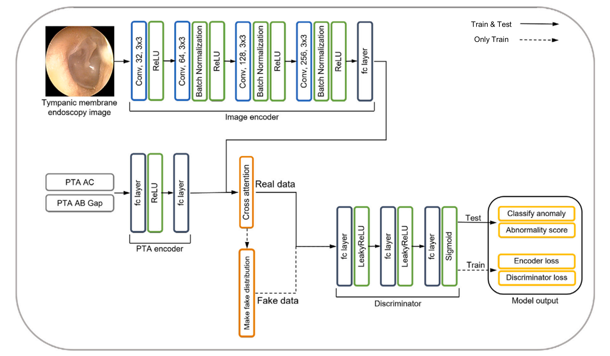

# Cooperative GAN: Automated Tympanic Membrane Anomaly Detection Using a Cooperative Observation Network

### Overview
<p align="center">
  
</p>
This repository contains the official implementation of

**“Cooperative GAN: Automated Tympanic Membrane Anomaly Detection Using a Cooperative Observation Network (CON)”**

published in *Computer Methods and Programs in Biomedicine*. 

CON is an **unsupervised, reconstruction-free anomaly detection model** for middle-ear disease screening. It is designed to detect a wide range of abnormal cases from **tympanic membrane endoscopic images and pure tone audiometry (PTA)** while being computationally lightweight enough for deployment in real clinical environments. 

---

### Dataset and Ethical Approval

All clinical data used in this study were collected at **Ansan Hospital, Korea University**. 

- **Total cases:** 1,470
    - 339 normal cases
    - 1,131 abnormal cases (perforation, retraction, cholesteatoma, two co-existing diseases, “other – requires treatment”, and normal-appearance tympanic membrane with hearing loss)
- **Training / test split for the anomaly detector:**
    - 271 normal cases used **only for training**
    - 68 remaining normal cases + all 1,131 abnormal cases (total 1,199) used for testing

The study was **approved by the Institutional Review Board of Ansan Hospital, Korea University (IRB No. 2021AS0329)** and conducted in accordance with the **1975 Helsinki Declaration**. 

Because of privacy and ethical constraints, **the clinical dataset is not included in this repository**.

---

### Dual-Modal Clinical Inputs (TM Image + PTA)

CON jointly uses:

- **Tympanic membrane endoscopic images**
    
    – resized to 128×128 and processed by a CNN-based image encoder. 
    
- **Pure tone audiometry (PTA) data**
    
    – PTA is summarized into two features per ear:
    
    - the **air-conduction (AC) average** at 500, 1000, 2000, and 4000 Hz
    - the **air–bone (AB) gap** (absolute difference between AC and bone-conduction averages), which we term **“AB GAP”**.

The PTA features are encoded by a lightweight MLP encoder. A **cross-attention module** fuses the image latent and PTA latent, producing a joint clinical representation that reflects both anatomical (image) and physiological (hearing) information. 

An ablation study demonstrates that **using only TM images or only PTA collapses performance (AUC ≈ 0.5), while using both modalities restores full performance**, confirming that the two clinical variables play complementary and essential roles. 

---

### Reconstruction-Free Cooperative Anomaly Detection

Conventional unsupervised anomaly detection typically:

1. Uses an encoder–decoder (e.g., VAE/AE/GAN-based) to reconstruct the input,
2. Computes an **abnormality score from reconstruction error**, and
3. Applies a **separate classifier or thresholding step** on that score. 

This method, reconstruction-based pipeline adds computational overhead and often requires extra classification logic. 

In contrast, **CON completely removes the reconstruction / decoding process** and performs anomaly detection in a **single step** via the GAN discriminator: 

- A **dual encoder** (image encoder + PTA encoder with cross-attention) produces a latent representation of **real (normal) clinical data**.
- Based on this real latent, **fake latent samples** are generated by injecting scaled noise using the latent mean and standard deviation. These fake samples intentionally deviate from the normal distribution while sharing its scale.
- A **discriminator** receives real vs. fake latent vectors and is trained to classify them using binary cross-entropy. At test time, **its sigmoid output itself becomes the anomaly score** (normal vs. abnormal), with no reconstruction required.

This design yields a **reconstruction-free, decoder-free, single-stage anomaly detector** that directly operates in latent space while still leveraging a GAN-style real vs. fake training signal.

---

### Performance and Efficiency

Using only 271 normal training cases and testing on 1,199 cases, CON achieves:

- **Accuracy:** 96.75%
- **AUC-ROC:** 0.93
- **F1-score:** 75.78% under highly imbalanced test data

Compared with common baselines (VAE, vanilla GAN), CON shows clearly superior anomaly detection performance on the same clinical task. 

In terms of computational cost, FLOPs analysis shows that CON is **about 10× lighter** than typical GAN-based anomaly detectors: 

- GAN: 2.98G FLOPs
- GANomaly: 3.04G FLOPs
- **CON: 0.21G FLOPs**

This makes CON well-suited for **resource-constrained clinical devices** that require both high accuracy and low computational load. 

---

### Repository Scope and Limitations

> Note (server & resources).
> 
> 
> The original research server that contained the **full dataset and detailed experimental scripts** was irreversibly lost due to an unexpected failure. As a result,
> 
> **this repository maintains and updates only the complete pipeline code prepared for the journal submission.**
> 
> – The clinical dataset is **not** provided.
> 
> – Several auxiliary experimental / ablation scripts from the original environment are **no longer recoverable**.
> 

The current code is intended as a faithful, end-to-end reference implementation of the CON pipeline described in the paper, suitable for re-implementation on other datasets with similar clinical structure.

---

### Intended Audience

This repository may be useful for:

- Researchers working on **medical anomaly detection**, **GAN-based anomaly models**, or **otologic image + audiometry fusion**.
- Clinicians and developers exploring **efficient, decoder-free screening tools** for middle-ear disease based on tympanic membrane images and PTA.

---

### Citation

If you use this repository or build upon CON in your research, please cite:

Dahye Song, Younghan Chung, Jaeyoung Kim, June Choi, Yeonjoon Lee,
**“Cooperative GAN: Automated Tympanic Membrane Anomaly Detection Using a Cooperative Observation Network,”**
*Computer Methods and Programs in Biomedicine*, 263 (2025) 108651.
https://doi.org/10.1016/j.cmpb.2025.108651
```bibtex
@article{song2025cooperative,
  title={Cooperative GAN: Automated tympanic membrane anomaly detection using a Cooperative Observation Network},
  author={Song, Dahye and Chung, Younghan and Kim, Jaeyoung and Choi, June and Lee, Yeonjoon},
  journal={Computer Methods and Programs in Biomedicine},
  volume={263},
  pages={108651},
  year={2025},
  publisher={Elsevier}
}
